## Anatomy

:::::: columns
::: {.column width="50%"}
Food moves from the throat

$\rightarrow$ esophagus

$\rightarrow$ stomach

$\rightarrow$ small bowel (jejunum)
:::

:::: {.column width="50%"}
::: {.content-visible unless-format="docx"}
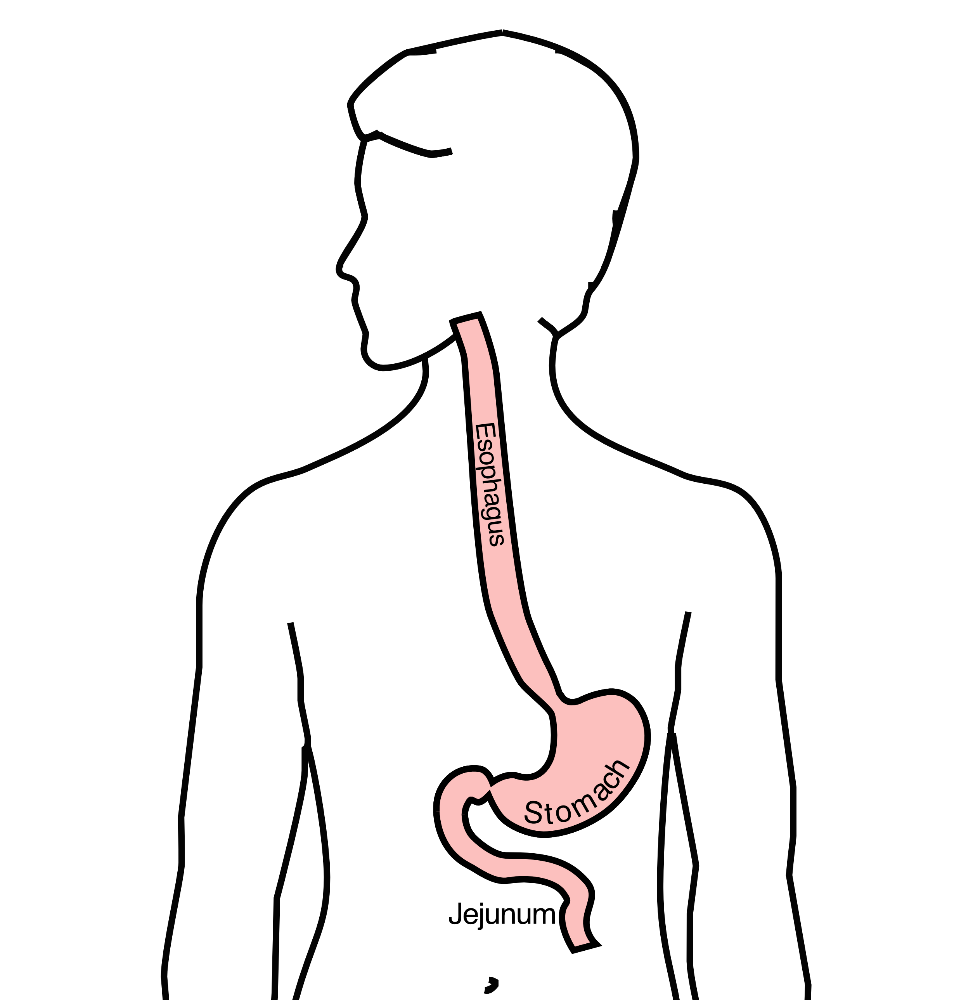\]
:::
::::
::::::

## Types of Esophageal Cancer

There are two common types of esophageal cancer

- Adenocarcinoma
- Squamous Cell Carcinoma

In many ways, these to different types of esophageal cancer behave the same.



## Gastroesophageal Reflux

:::::: columns
::: {.column width="50%"}
A one-way valve normally keeps acid within the stomach and prevents it from entering the esophagus
:::

:::: {.column width="50%"}
::: {.content-visible unless-format="docx"}
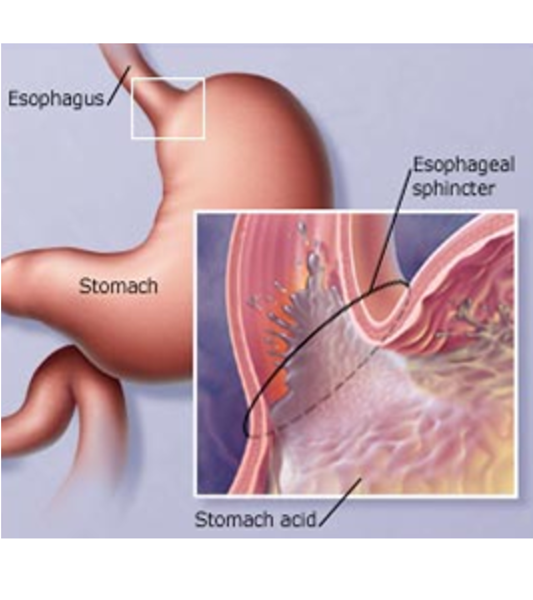
:::
::::
::::::

## Gastroesophageal Reflux

:::::: columns
::: {.column width="50%"}
A one-way valve normally keeps acid within the stomach

If the valve does not work properly, acid enters the esophagus and cause heartburn and damage to the lining of the esophagus.
:::

:::: {.column width="50%"}
::: {.content-visible unless-format="docx"}

:::
::::
::::::

## Barrett's Esophagus

:::::: columns
::: {.column width="50%"}
Over time, the lining of the esophagus undergoes change in response to the acid.
:::

:::: {.column width="50%"}
::: {.content-visible unless-format="docx"}
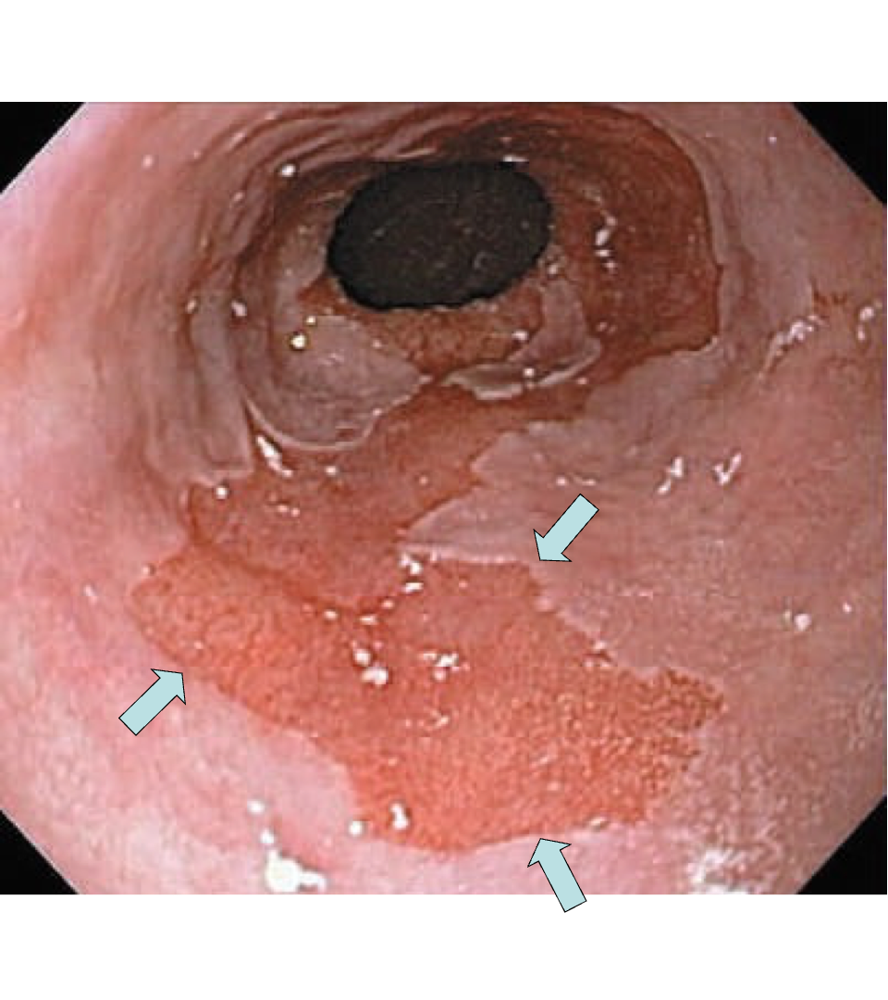
:::
::::
::::::

## Dysplasia

Over a period of years, pre-cancerous changes can develop within Barrett's esopahgus.

These changes can be seen by the pathologist from biopsies taken from the esophagus

::: fragment
Over time, low-grade dysplasia can progress to high-grade dysplasia
:::

## Dysplasia $\rightarrow$ Cancer

Low grade dysplasia: Risk of cancer 0.5% per year

::: fragment
High-grade dysplasia: Risk of cancer 5% per year
:::

::: fragment
$\Rightarrow$ Surveillance with upper endoscopy is critical
:::

## Radiofrequency ablation for Dysplasia

:::::: columns
::: {.column width="50%"}
Dysplasia can be treated with destroying the mucosa, the inner layer of esophgus

Ablation of the mucosa with microwave energy

Circular balloon with an antenna used to ablate the mucosa
:::

:::: {.column width="50%"}
::: {.content-visible unless-format="docx"}

:::
::::
::::::

::: {.content-hidden unless-format="docx"}
Because the risk of spread to the lymph nodes is very low, there tumors can often be removed with endoscopy without the need for surgery.
:::

## Radiofrequency ablation for Dysplasia

:::::: columns
::: {.column width="50%"}
Before Ablation

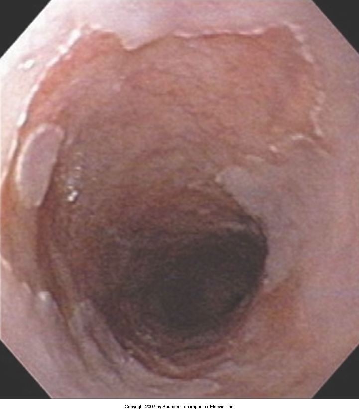
:::

:::: {.column width="50%"}
::: {.content-visible unless-format="docx"}
After Ablation

:::
::::
::::::

::: {.content-hidden unless-format="docx"}
Because the risk of spread to the lymph nodes is very low, there tumors can often be removed with endoscopy without the need for surgery.
:::

## Treatment Plan

::::::: {style="font-size: 90%;"}
::: fragment
Superficial (T1)

- Endoscopic Therapy
:::

::: fragment
Localized (T1b/T2)

- Surgery (esophagectomy)
:::

::: fragment
Locally-advanced (T3M0)

- Chemo$\pm$Radiation $\rightarrow$Surgery
:::

::: fragment
Metastatic (M1)

- Chemotherapy
:::
:::::::

::: {.content-hidden unless-format="docx"}
This table summarizes four different treatment categories:

- Superficial cancers are T1 and can be treated by endoscopic therapy without the need for surgery
- Localized cancers are T1b or T2 and are frequently treated by surgery alone without the need for chemotherapy or radiation
- Locally-advanced cancers are T3 or N1 and are usually treated with some combination of chemotherapy and radiation prior to surgery
- Metastatic cancers are M1 and are treated primary by chemotherapy.
:::

## Superficial Cancers = T1a

Treatment is often with by endoscopic resection without the need for surgery.

::: {.content-hidden unless-format="docx"}
Becauase the risk of spread to the lymph nodes is very low, there tumors can often be removed with endoscopy without the need for surgery.
:::

## Endoscopic Resection

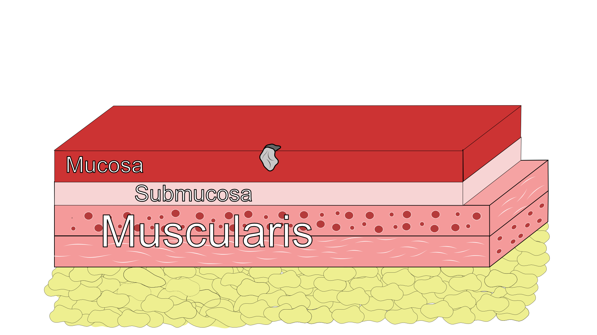

## Tumor Lift

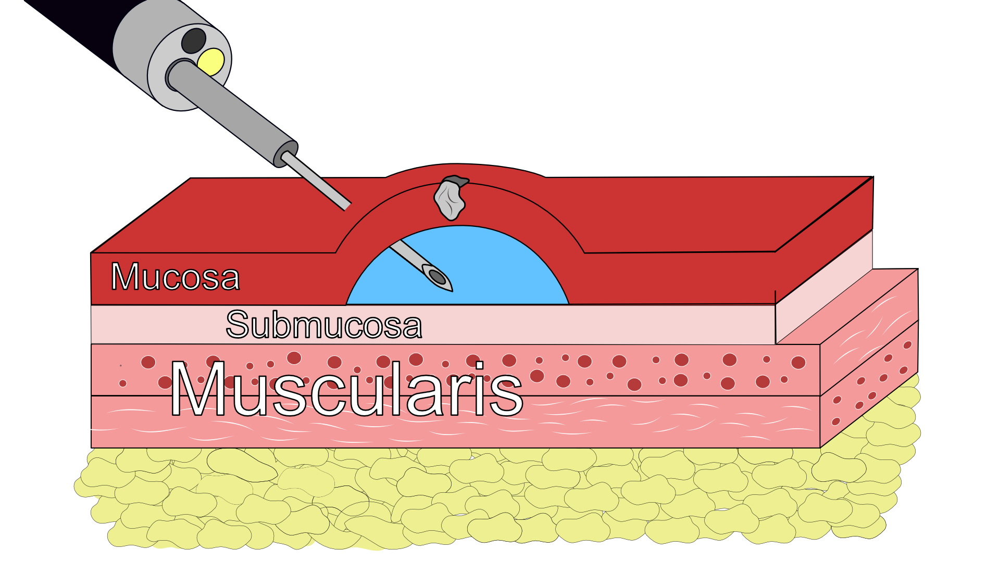

## Tumor Lift

## Tumor Removal - Resection

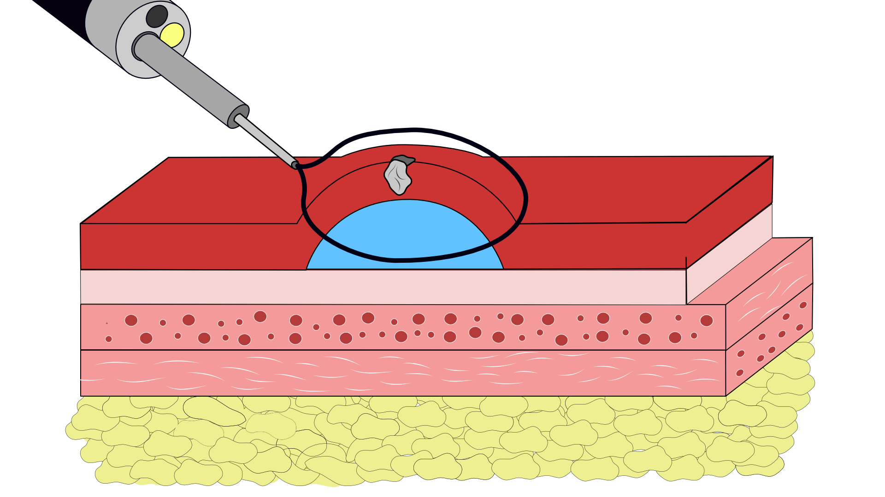 \## Tumor Removal - Dissection

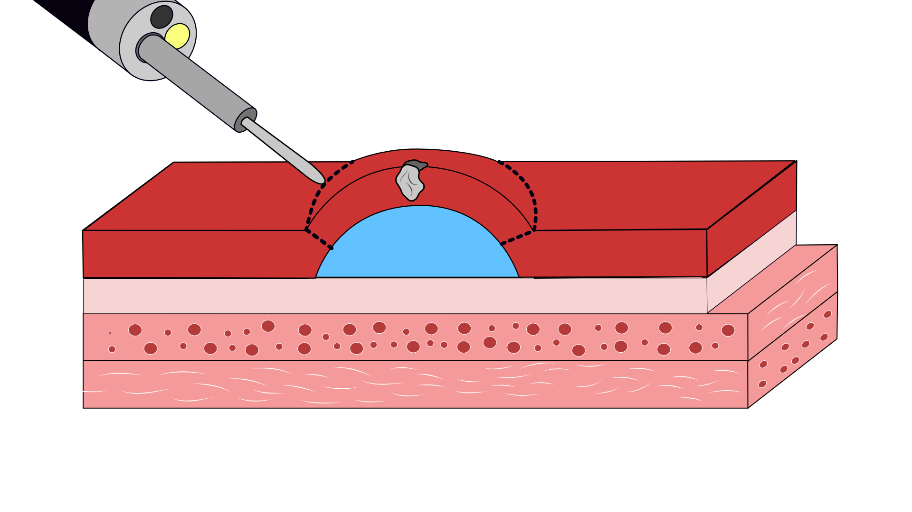 \## Tumor Removal - Dissection

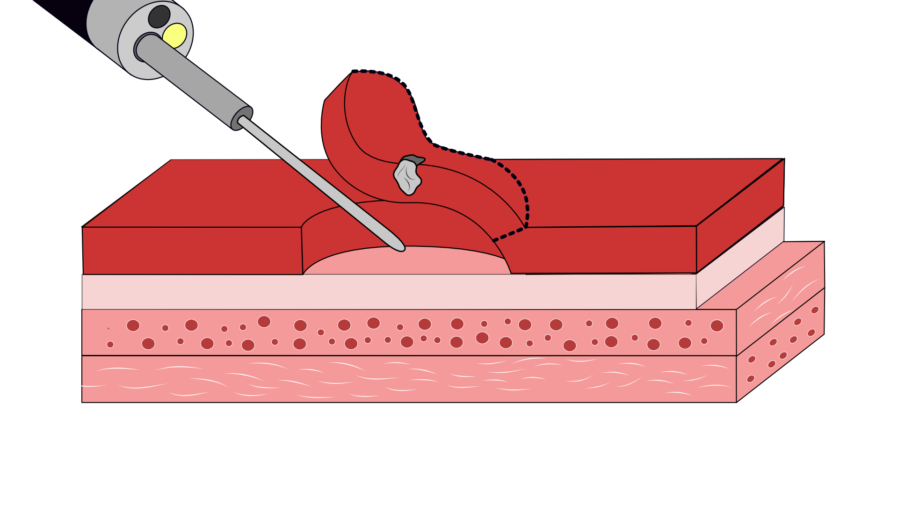

## Endoscopic Resection - Favorable {auto-animate="true"}

::::: columns
::: {.column width="50%"}
- Clear edge margin *AND*
- Clear deep margin *AND*
- Tumor slow-growing under microscope
:::

::: {.column width="50%"}
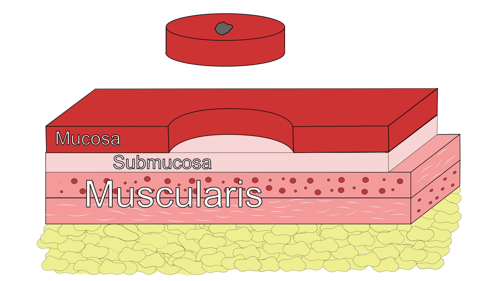
:::
:::::

## Endoscopic Resection - Favorable {auto-animate="true"}

::::: columns
::: {.column width="50%"}
- Clear edge margin *AND*
- Clear deep margin *AND*
- Tumor slow-growing under microscope
:::

::: {.column width="50%"}
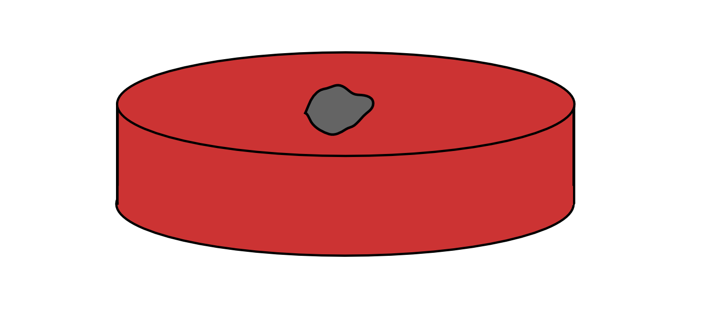
:::
:::::

## Endoscopic Resection - Favorable {auto-animate="true"}

::::: columns
::: {.column width="50%"}
- May be the only treatment required
- Requires endoscopic surveillance
:::

::: {.column width="50%"}

:::
:::::

## Endoscopic Resection - Unfavorable {auto-animate="true"}

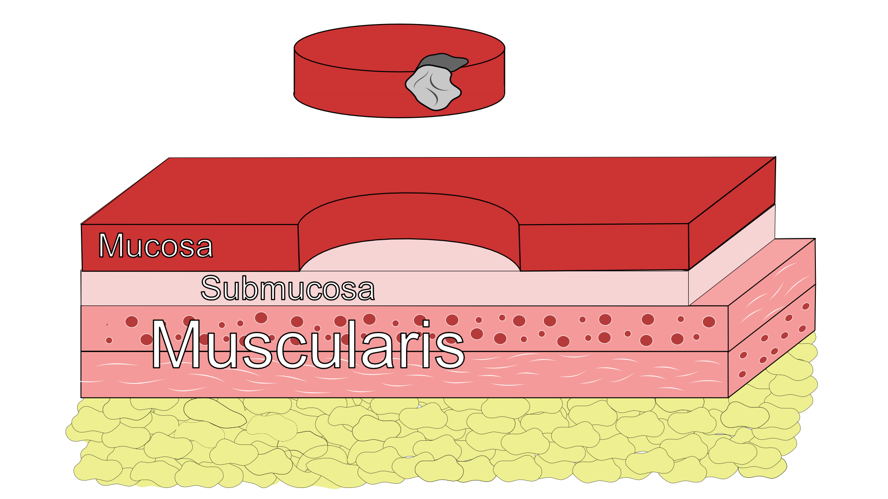

## Endoscopic Resection - Unfavorable {auto-animate="true" auto-animate-restart="true"}

::::: columns
::: {.column width="50%"}
- Tumor at edge margin *OR*
- Tumor at deep margin *OR*
- Tumor rapidly-growing under microscope
:::

::: {.column width="50%"}
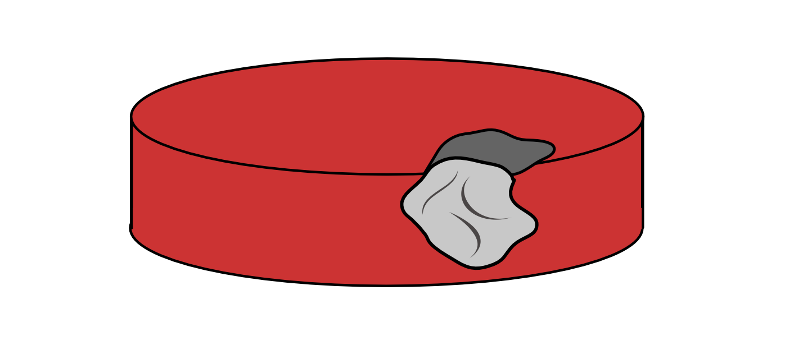
:::
:::::

## Endoscopic Resection - Unfavorable {auto-animate="true"}

::::: columns
::: {.column width="50%"}
Esophagectomy (surgery) is standard recommendation
:::

::: {.column width="50%"}
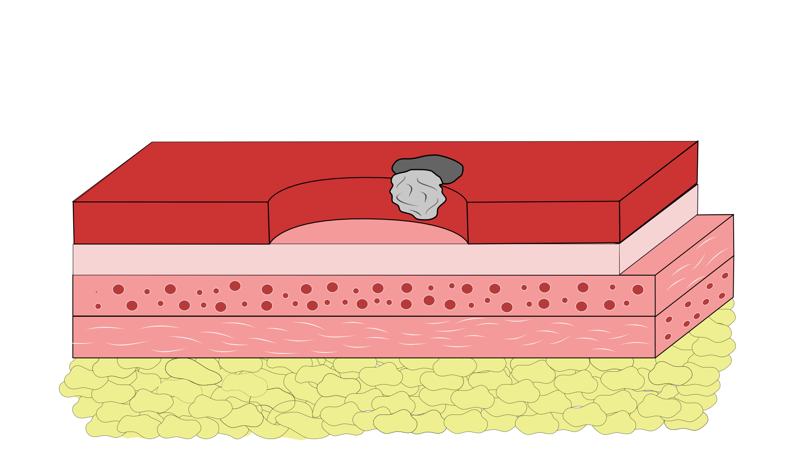
:::
:::::

::: {.content-hidden unless-format="docx"}
For patients with superficial cancers that can't be adequately treated with endoscopic therapy, surgery is usually recommended
:::

## Endoscopic Resection - Positive Deep Margin {auto-animate="true"}

::::: columns
::: {.column width="50%"}
- Tumor at edge margin *OR*
- **Tumor at deep margin** *OR*
- Tumor rapidly-growing under microscope
:::

::: {.column width="50%"}
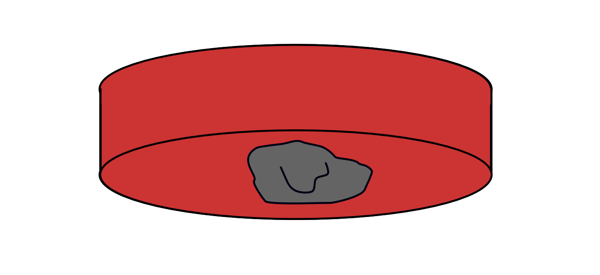
:::
:::::

::: {.content-hidden unless-format="docx"}
For patients with superficial cancers that can't be adequately treated with endoscopic therapy, surgery is usually recommended
:::

## Endoscopic Resection - Positive Deep Margin {auto-animate="true"}

::::: columns
::: {.column width="50%"}
- Tumor at edge margin *OR*
- **Tumor at deep margin** *OR*
- Tumor rapidly-growing under microscope
:::

::: {.column width="50%"}
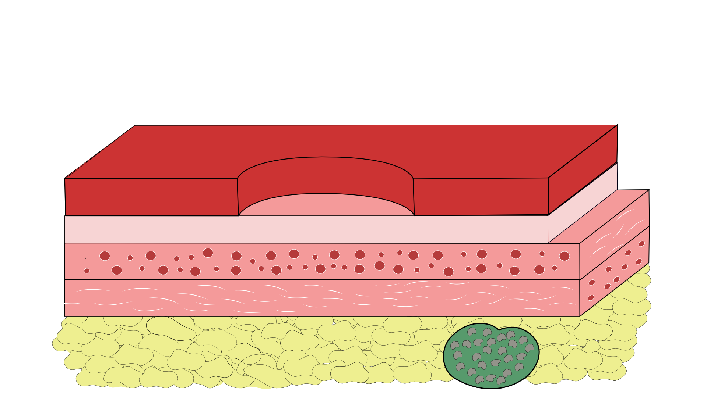
:::
:::::

::: {.content-hidden unless-format="docx"}
For patients with superficial cancers that can't be adequately treated with endoscopic therapy, surgery is usually recommended
:::

## Endoscopic Resection - Positive Deep Margin {auto-animate="true"}

::::: columns
::: {.column width="50%"}
- Tumor at edge margin *OR*
- **Tumor at deep margin** *OR*
- Tumor rapidly-growing under microscope
:::

::: {.column width="50%"}

:::
:::::

::: {.content-hidden unless-format="docx"}
For patients with superficial cancers that can't be adequately treated with endoscopic therapy, surgery is usually recommended
:::

## Unable to Lift Tumor

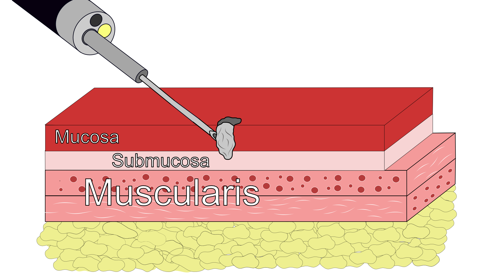
