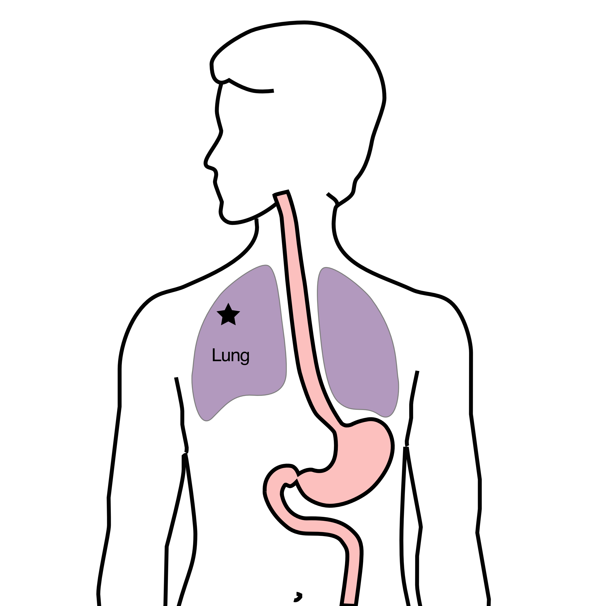
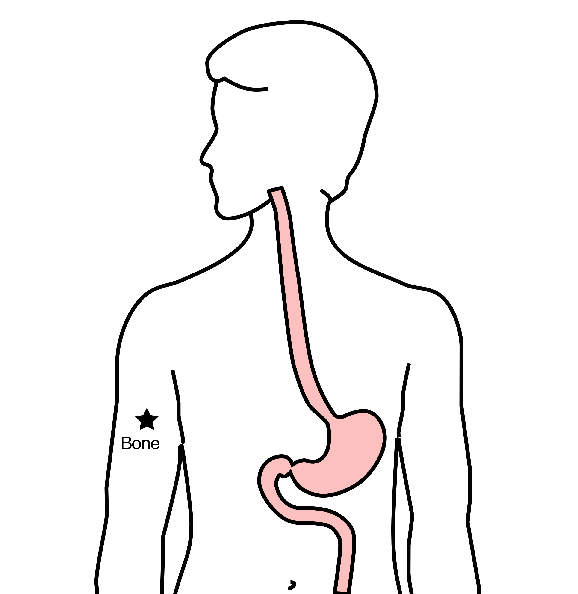
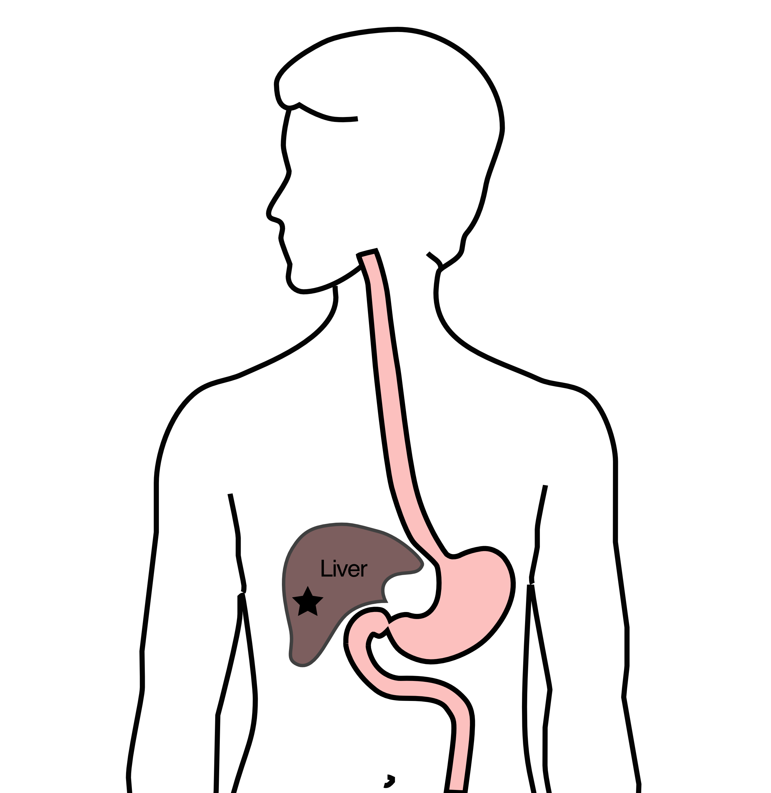

## Anatomy

::::::: columns
:::: {.column width="50%"}
::: {style="font-size: 95%;"}
Food moves from the throat

$\rightarrow$ esophagus

$\rightarrow$ stomach

$\rightarrow$ small bowel (jejunum)
:::
::::

:::: {.column width="50%"}
::: {.content-visible unless-format="docx"}
\]
:::
::::
:::::::

::: {.content-hidden unless-format="docx"}
We'll start with reviewing some anatomy about how the body digests food.

Food moves from the throat to the esophagus, and from there to the stomach.

From the stomach, food moved through a valve called the pylorus into the small intestines
:::





## Treatment Plan

\
Superficial (T1a): Endoscopic Therapy\
\
Localized (T1b/T2): Surgery\
\
Locally-advanced (T3M0): Chemo $\rightarrow$ Surgery\
\
Metastatic (M1): Chemotherapy

::: {.content-hidden unless-format="docx"}
This table summarizes four different treatment categories:

- Superficial cancers are T1 and can be treated by endoscopic therapy without the need for surgery
- Localized cancers are T1b or T2 and are frequently treated by surgery alone
- Locally-advanced cancers are T3 and M0 and are usually treated with chemotherapy prior to surgery
- Metastatic cancers are M1 and are treated primary by chemotherapy.
:::

## Tumor Biomarkers - Additional Pathology

- PD-L1 $\rightarrow$ Immunotherapy can be helpful
- MMR $\rightarrow$ Immunotherapy can be very helpful
- HER-2 $\rightarrow$ Herceptin (Stage IV)
- Claudin 18.2 $\rightarrow$ zolbetuximab (Stage IV)

Biomarkers reported in a separate pathology report

Your medical oncologist will review these with you

## Tumor Genetic Analysis 

For patients with Stage IV disease, genetic testing of the cancer can be performed:

May help identify effective drugs

Your medical oncologist will review these with you



## Restaging

CT performed every 3-6 months to guide therapy

\

- If CT shows shrinkage of tumor $\rightarrow$ continue

- If CT shows growth of tumor $\rightarrow$ switch drugs





## Additional Therapy - Lung Metastasis

:::::: columns
::: {.column width="50%"}

If there is a solitary spread of cancer to the lung:

\
Stereotactic radiation can be performed

Treatment will take 2-3 sessions

:::

:::: {.column width="50%"}
::: {.content-visible unless-format="docx"}

:::
::::
::::::

::: {.content-hidden unless-format="docx"}
If the lymph nodes contain enough cancer cells, they can be seen on CT scans or PET scans
:::

## Additional Therapy - Bone Metastasis

:::::: columns
::: {.column width="50%"}
\
Spread of cancer to bone can be painful

\
Radiation therapy can be very effective

Treatment can be one in 1 to 10 doses 

:::

:::: {.column width="50%"}
::: {.content-visible unless-format="docx"}

:::
::::
::::::

::: {.content-hidden unless-format="docx"}
If the lymph nodes contain enough cancer cells, they can be seen on CT scans or PET scans
:::

## Additional Therapy - Liver Metastasis

:::::: columns
::: {.column width="50%"}
Several treatment options for spread of cancer to the liver that does not respond to chemotherapy:

- Stereotactic radiation
- Microwave ablation
- Radioactive beads

:::

:::: {.column width="50%"}
::: {.content-visible unless-format="docx"}

:::
::::
::::::

::: {.content-hidden unless-format="docx"}
If the lymph nodes contain enough cancer cells, they can be seen on CT scans or PET scans
:::

## Additional Therapy - Carcinomatosis

:::::: columns
::: {.column width="50%"}

Treatment for spread of cancer within the abdomen:

- Intraperitoneal chemo via catheter (Taxol)
- Heated intraperitoneal chemotherapy (HIPEC)
- Cytoreductive surgery (often in combination with HIPEC)

:::

:::: {.column width="50%"}
::: {.content-visible unless-format="docx"}

:::
::::
::::::

::: {.content-hidden unless-format="docx"}
If the lymph nodes contain enough cancer cells, they can be seen on CT scans or PET scans
:::

## Additional Therapy - Surgery

Surgery can be performed in selected circumstances:

- Perforation 
- Obstruction

  - Removal of cancer and a portion of the stomach
  - Bypass of the cancer
  
- Residual disease in the stomach in patients responding to chemotherapy




