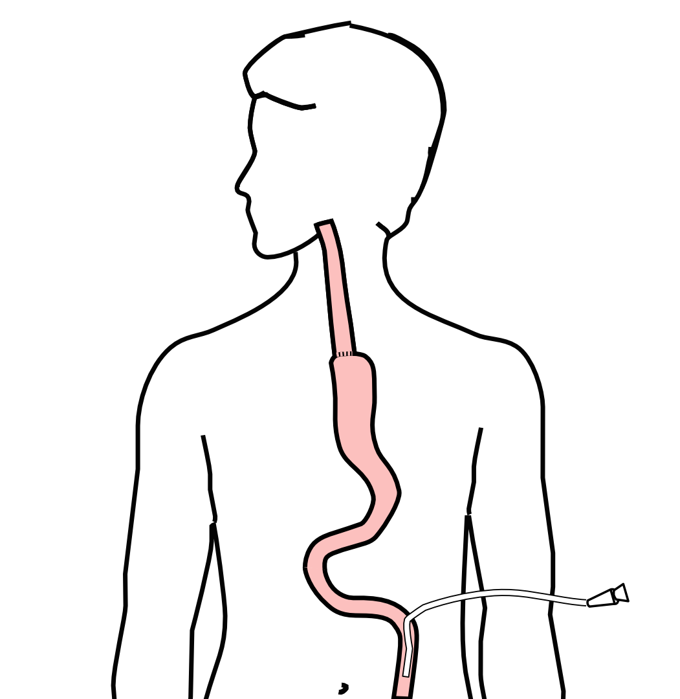
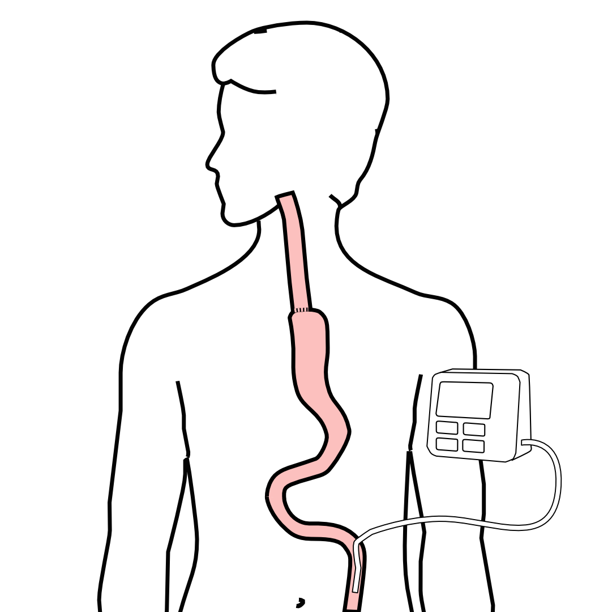
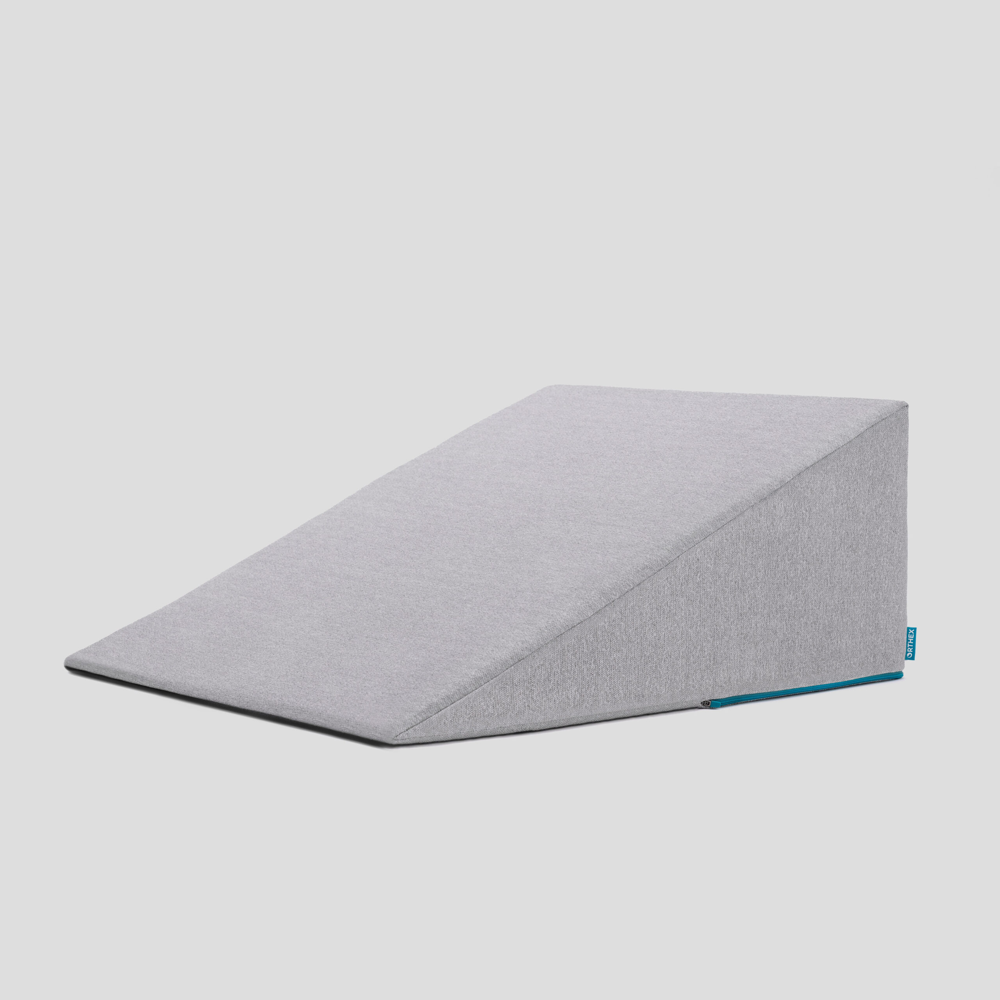

## Epidural Catheter for Pain Control

- Remains in place for 2-5 days
- Dosage can be adjusted as needed
- Can make it more difficult to urinate
- May require foley catheter in bladder
- Foley catheter removed after epidural removed

## Jejunostomy Feeding Tube

::::: columns
::: {.column width="50%"}

A temporary feeding tube is placed to supplement nutrition by mouth.

This will stay in place for about 8 weeks after surgery
:::

::: {.column width="50%"}

:::
:::::

## Intensive Care Unit (ICU) (2-4 days)

- Surgical ICU on 11th floor
- NG tube in nose to drain stomach and esophagus
- Catheter in bladder
- Chest tube right chest
- Abdominal drains (usually 2)
- Feeding jejunostomy (usually stays in 8 wks)

## Intensive Care Unit (ICU)

- Bladder catheter removed → check that bladder empties properly
- Chest tube removed (day 2-4) → follow-up x-ray
- Fluid emptied from drains every few hours
- Start tube feedings by feeding
- Feeding jejunostomy (stays in 8 weeks)

## Ward - 6Tower
- Up in a chair most of the day
- Walking in the halls
  - Start with assistance
  - Improves lung function
  - Prevents loss of muscle strength

## Jejunostomy Feeding Tube

::::: columns
::: {.column width="50%"}

Feedings are administered through the jejunostomy at night by a pump
:::

::: {.column width="50%"}

:::
:::::

## Jejunostomy Feeding

- Start with continuous feeds (24 hours/day)
- Convert to nocturnal (night-time): 6pm to 10pm

The feeding bag holds only 4 cartons of feeds - May need to "top off' bag after a few hours

Water through the tube 

- Important to prevent dehydration 
- 240mL (8 oz) 4 times per day



## Activity after Surgery

- Up in chair most of the day
- Walking with help from nurse/Physical Therapist
- Goals:
  - Improve lung function
  - Prevent muscle loss

## Nasogastric (NG) Tube

Tube passed through nose into stomach

- Drains fluid from stomach
- Prevents vomiting

Upper GI X-ray on 2nd or 3rd day after surgery

- If stomach empties well $\rightarrow$ NG tube removed
- Otherwise, X-ray repeated 2-3 days later

## Swallowing Evaluation

Once NG tube has been removed:

Modified barium swallow in radiology

- Drink a white chalky liquid (barium)
- Look for proper swallowing function
- 80% of patients $\Rightarrow$ liquids started by mouth

## Oral Intake at Home

Most are taking protein shakes when they go home

Protein shakes are started after tolerating water\

- 2 oz per hour to start
- 4 oz per hour if 2oz are tolerated well

## Drains and Tubes

Chest Tube (right side): Removed 4-6 days after surgery (depending upon output) 
Abdominal drains: Removed 4-7 days after surgery 

- Discharge with 1 abdominal drain in 10% of cases 

Epidural catheter: Removed 4-5 days after surgery 
Bladder catheter: Removed after epidural catheter removed

## Discharge

Goal: ready to leave day #7 after surgery

- Night-time tube feedings (6pm to 10am)
- Nutrition by mouth (90% of patients)
  - Protein shakes or water 4oz every 2 hours
- Water through tube 8oz four times per day
- Home care nursing (feeding tube teaching)
- Home infusion (tube feeding supplies)

## Nutrition after Surgery

At discharge home:

- Protein shakes 4oz every 2 hrs
- Tube feeds 4-5 cans at night (6pm-10am)

10-12 Days: Increase protein shakes

- Tube feeds 3-4 cans at night

Three weeks: Post-esophagectomy Diet

8-12 weeks: Remove feeding tube (in office)

## Transition from Tube Feeds $\rightarrow$ Eating

Dietitian will calculate daily protein goal

- Typically 60-75 grams protein/day
- Each carton of tube feeding has 15 grams
  - 75 grams protein = 5 cartons/night
- More intake by mouth $\rightarrow$ tube feeds reduced

Spread out protein during the day (20gm/meal)

- Three meals + 2-3 high-protein snacks

## Post-esophagectomy Diet

- Soft Consistency
- High Protein
- Avoid sugary liquids (can cause ‘dumping’)
- Avoid raw vegetables (and salads)
- Eating
  - Small, frequent meals
  - Sit up for 30-45 minutes after eating
  - Avoid eating within 2 hours of bedtime

## Medicines at Home - Pain

Acetaminophen (Tylenol) 1000mg 4x/day

Gabapentin 300mg 3 times/day

Oxycodone

- As needed in addition to Tylenol/gabapentin
- Will begin reducing dose at first postop visit
- Can usually discontinue by 4 weeks
- NO DRIVING WHILE ON OXYCODONE

## Non-steroidals Anti Inflammatory (NSAID)

Non-steroidal anti-inflammatories (Celebrex)

- 200 mg every 12 hours starting at 2 weeks

NO GOODY POWDERS OR BCs

- (Can cause permanent scarring at the surgery site)

## Acid Blockers = Proton Pump Inhibitors

Examples include ompeprazole and pantoprazole

- Will stay on for at 1-2 years to prevent acid reflux
- Important in preventing scarring at anastomosis (new connection between esophagus and stomach)
- To administer through feeding tube, open capsule and resuspend beads in 60mL (2oz) of water

## Medicines at Home

Reglan – Helps stomach empty

- Will plan to stop after six weeks
- 0.1% risk of tardive dyskinesia (nervous tic)

Remeron – Helps improve appetite

- Can cause vivid dreams
- Used for several weeks after surgery
- Will stop within first three months of surgery

## Metoprolol = Beta Blockers

- Slows heart rate and lowers blood pressure\
- Used to prevent rapid heart rate
- Patients not taking a beta blocker prior to surgery $\rightarrow$ wean after after surgery
- Patients taking a beta blockerprior to surgery $\rightarrow$ return to prior dose and drug after surgery

## Sleeping at Home

::::: columns
::: {.column width="50%"}
Reflux can occur the first few weeks/months after surgery

This improves over the first few months

A wedge pillow can be helpful for sleep
:::

::: {.column width="50%"}

:::
:::::

## Follow Up Visit 7-10 days after Discharge

In-person clinic visit with Dr Salo or Kate Duncan

- Check surgical site
- Remove staples (if needed)
- Remove abdominal drains (if needed)

Meet with dietitian:

- Reduce tube feeds
- Advance diet by mouth

## Adjust Medicines after Surgery

Reglan: Discontinue 6 weeks after surgery Remeron: Discontinue 12 weeks after surgery Pain Medicines:

- Wean oxycodone within 6 weeks of surgery
- Discontinue gabapentin and acetaminophen (Tylenol) within 8 weeks

Continue acid blockers (PPI) for at least 1 year

Reduce metoprolol to once/day for 7 dayus $\rightarrow$ discontinue

## Second Follow Up Visit

4-5 weeks after first post-operative visit

- Discuss diet
- Discuss medicines
- Plan for jejunostomy removal
- Evaluate readiness for chemotherapy after surgery (usually 6 weeks)

## Eating after Surgery

First Postoperative Visit: Start soft foods (Phase I)

Weekly virtual visits with dietitian

Jejunostomy removal ~ 8 weeks after surgery

## Jejunostomy Removal

Jejunostomy tube is removed in the office once you can take in enough nutrients by mouth

Removal usually around 8 weeks after surgery (may be longer if chemotherapy planned after surgery)

May take 30 minutes and some local anesthetic to loosen up the tube for removal.

## Nutritional Monitoring after Surgery

You may have difficulty absorbing some nutrients:

- Iron
- Vitamin B12
- Vitamin D

## Nutritional Monitoring after Surgery

About 3 months after the jejunostomy tube is removed, we will check blood levels:

- Iron (ferritin)
- Vitamin B12
- Vitamin D

## Nutritional Replacements after Surgery

Vitamin or iron replacements can be ordered by:

- Primary Care Provider (PCP)
- Medical Oncologist
- Surgeon

If levels are low

- Replacement
- Repeat testing in 3-6 months

