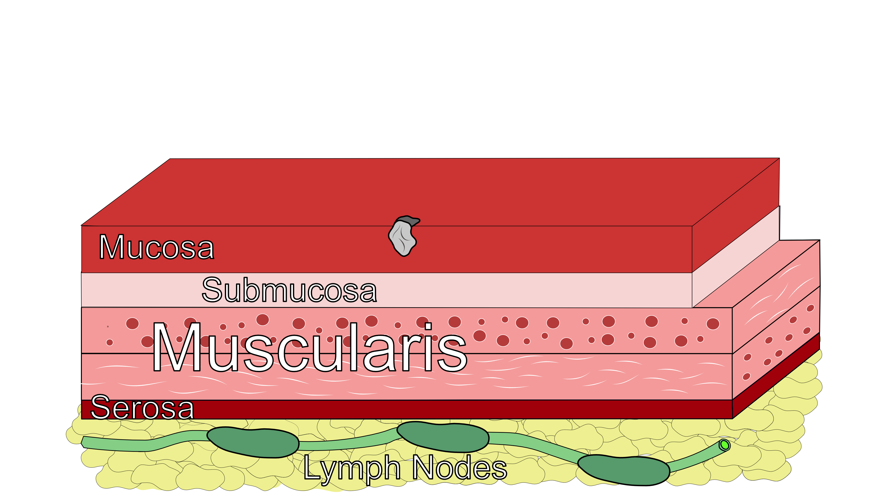
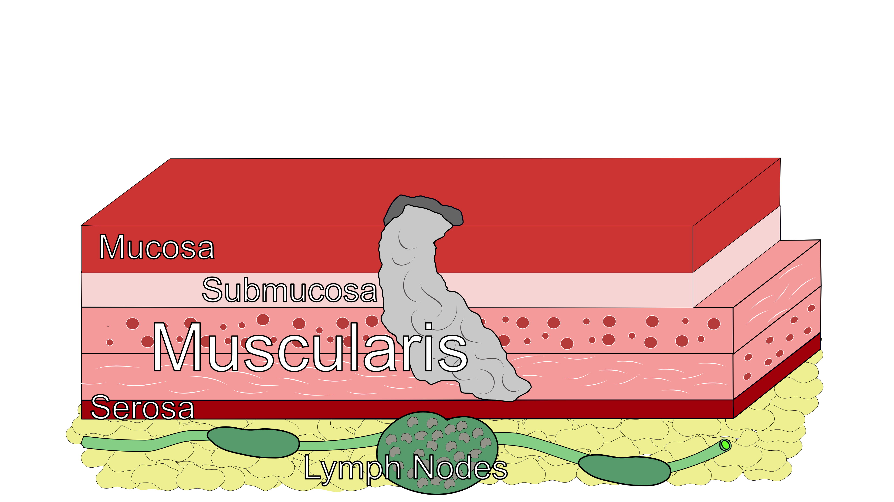
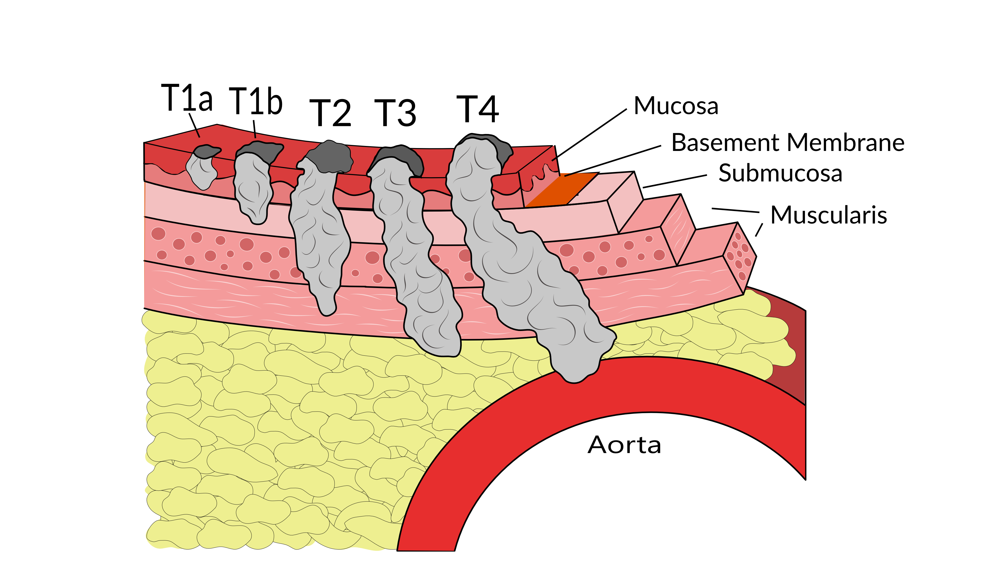
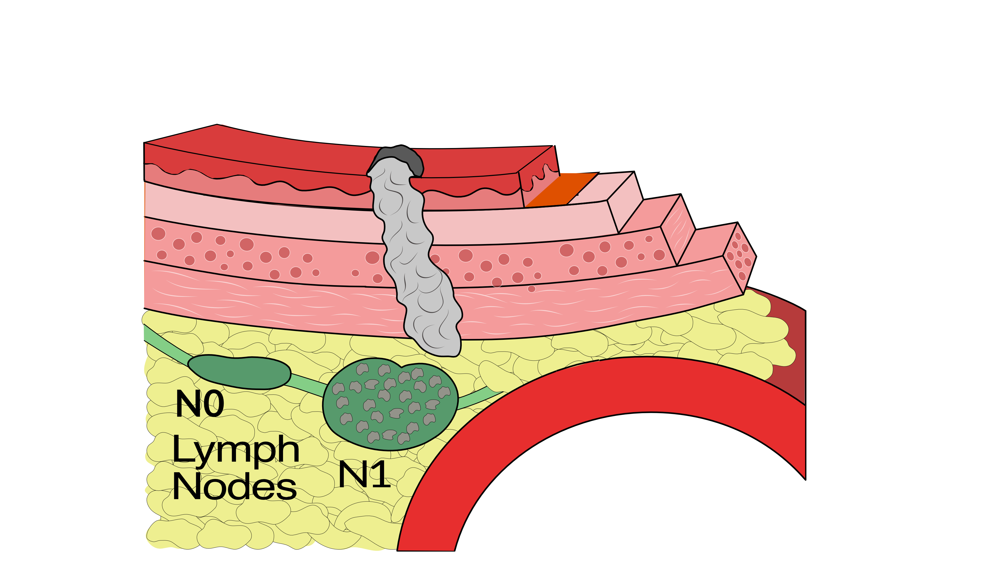
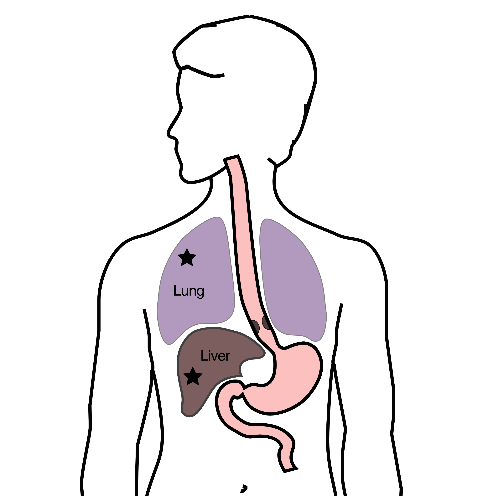
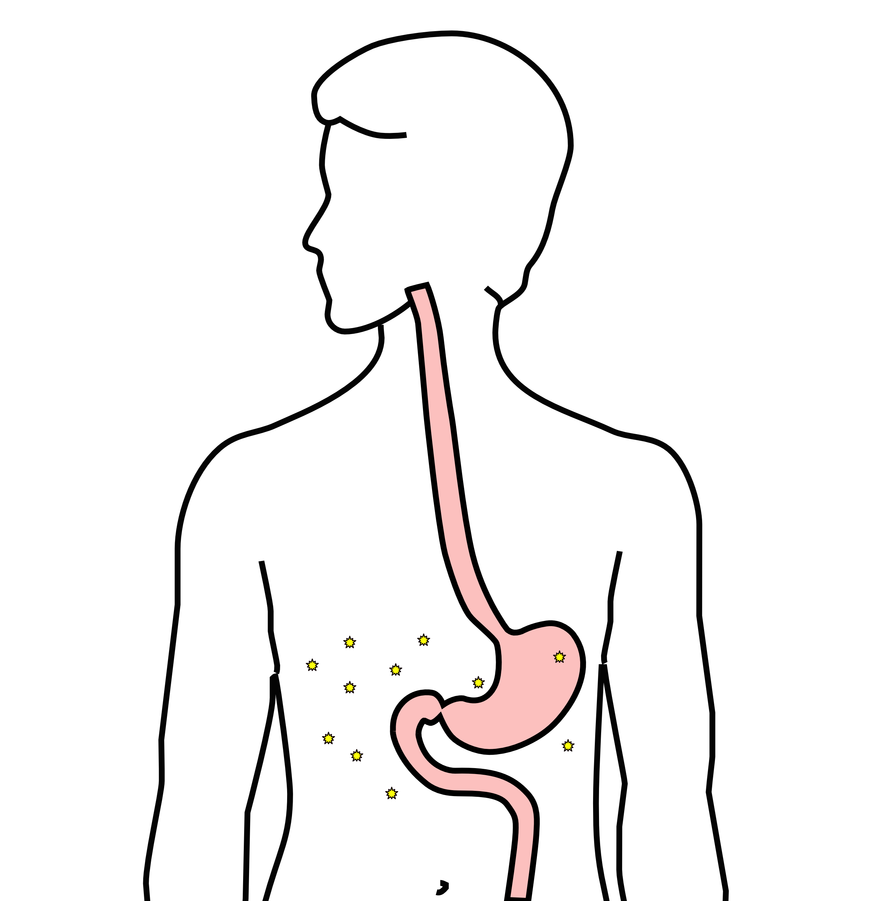
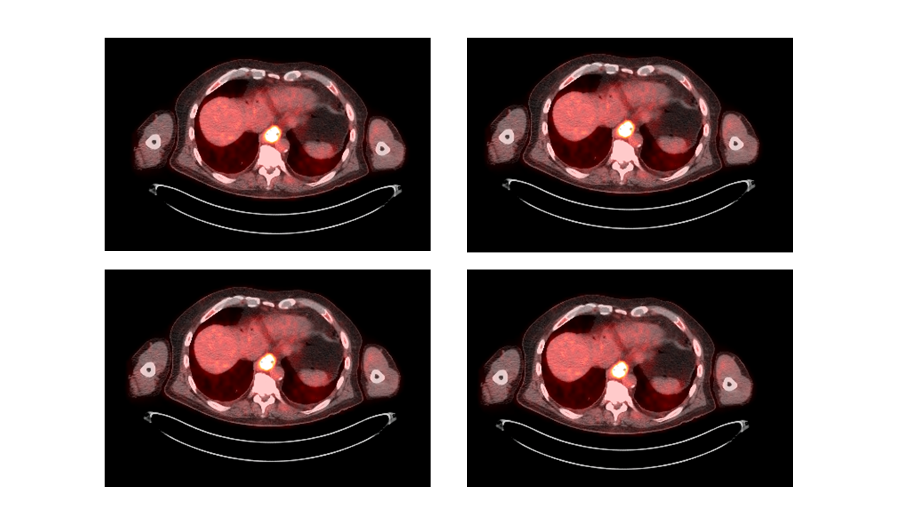
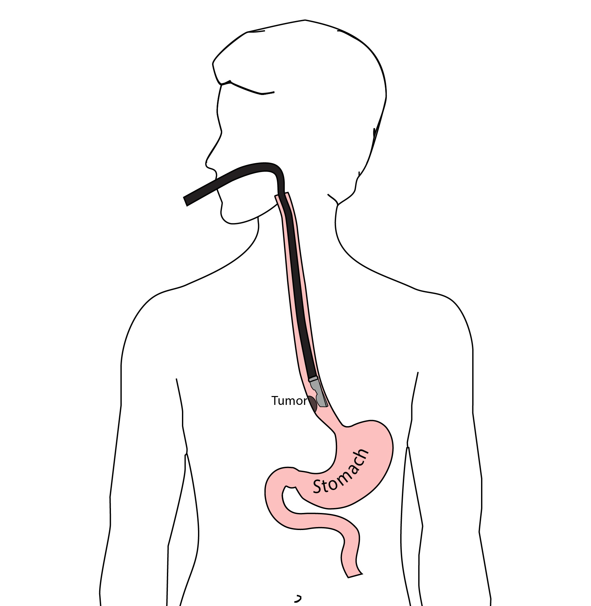

## Cancer Staging

Staging refers to the tests to determine

- How large is the tumor?
- Has there been spread to lymph nodes?
- Has it spread to other parts of the body?

**Treatment options depend upon the cancer stage**

## Cancer Staging {tbl-colwidths="[20,10,70]"}

- **T** = Tumor - Depth of growth into the wall\
  \
- **N** = Nodes - Spread to the lymph nodes\
  \
- **M** = Metastasis - Spread to liver, lungs, or bone

## Early Stage Cancers

::: {.content-hidden unless-format="docx"}
Early-stage cancers are those that are small and have not grown very far into the wall
:::

:::::: columns
::: {.column width="50%"}
\
\
Cancers start on the very inside layer called the mucosa
:::

:::: {.column width="50%"}
::: {.content-visible unless-format="docx"}

:::
::::
::::::

## Locally-advanced Cancers

:::::: columns
::: {.column width="50%"}
\
\
Over time, cancers can grow into the muscular wall
:::

:::: {.column width="50%"}
::: {.content-visible unless-format="docx"}

:::
::::
::::::

::: {.content-hidden unless-format="docx"}
Locally-advanced cancers are those that have grown through the wall
:::

## Lymph Nodes

:::::: columns
::: {.column width="50%"}
\
\
In some cases, cancer cells can break off from the main tumor and spread to lymph nodes
:::

:::: {.column width="50%"}
::: {.content-visible unless-format="docx"}

:::
::::
::::::

::: {.content-hidden unless-format="docx"}
If the lymph nodes contain enough cancer cells, they can be seen on CT scans or PET scans
:::

## T Stage

:::::: columns
::: {.column width="50%"}
\
\
Cancers are categorized based upon the thickness of the tumor, known as the T stage
:::

:::: {.column width="50%"}
::: {.content-visible unless-format="docx"}

:::
::::
::::::

::: {.content-hidden unless-format="docx"}
T1 tumors are early stage, and T4 tumors more advanced
:::

## N Stage

:::::: columns
::: {.column width="50%"}
Cancers are categorized by whether there is spread to the nodes.

- **N0** cancers have not spread to the nodes
- **N1** cancers have spread to the nodes.
:::

:::: {.column width="50%"}
::: {.content-visible unless-format="docx"}

:::
::::
::::::

## M Stage

:::::: columns
::: {.column width="50%"}
Some cancers spread to other parts of the body

- **M0** cancers have not spread
- **M1** cancers have spread to lungs, liver, bone, or within the abdomen
:::

:::: {.column width="50%"}
::: {.content-visible unless-format="docx"}

:::
::::
::::::

## Carcinomatosis (M1)

:::::: columns
::: {.column width="60%"}
Spread within the abdomen is **carcinomatosis**

Tumors can be very small (grain of rice)

Fluid can also build up: **ascites**
:::

:::: {.column width="40%"}
::: {.content-visible unless-format="docx"}

:::
::::
::::::

## PET scan

:::::: columns
::: {.column width="40%"}
Similar to CT scan

Tracer shows 'hot spots'

- Cancer
- Inflammation or infection
- Normal organs (heart, kidneys)
:::

:::: {.column width="60%"}
::: {.content-visible unless-format="docx"}

:::
::::
::::::

::: {.content-hidden unless-format="docx"}
In some cases, the PET scan is not performed until a CT scans b=has been done.
:::

## PET scan Preparation

- Nothing to eat or drink for 4 hours prior to exam

- High-protein low-carbohydrate diet the day prior

- No strenous activity day prior to study

## PET scan Prepration - Diabetic Patients

PET scan uses a modified sugar as a tracer $\Rightarrow$ you will need to be careful about blood sugar and insulin before the study

- No insulin within 4 hours of the exam
- OK to take diabetes pills the day of the exam
- PET scans are generally best in the morning
- Plan to eat a meal after the PET scan, with half the usual morning dose of insulin

## PET scan Prepration - Diabetic Patients

- If PET is scheduled after 10AM:
  - low-carbohydrate breakfast at least 4 hours before
  - half the usual regular (short-acting) insulin
- No long-acting insulin after midnight.
- Insulin pump: turn it off 4 hours before the study (or turn it down to basal/night-time rate)

## Endoscopic Ultrasound

:::::: columns
::: {.column width="60%"}
- Similar to upper endoscopy (EGD)
- Ultrasound in scope
- Evaluates T stage
:::

:::: {.column width="40%"}
::: {.content-visible unless-format="docx"}

:::
::::
::::::

::: {.content-hidden unless-format="docx"}
Endoscopic ultrasound is most helpful in early stage cancers.
:::
